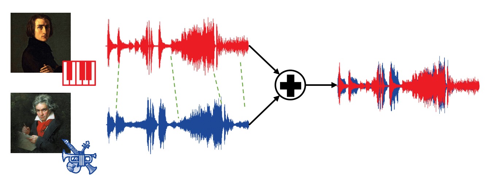

<table border="0">
  <tr>
    <td></td>
    <td><h2>Source Separation of Piano Concertos</h2>
      This repository provides a pipeline for  decomposing piano concerto recordings into separate piano and orchestral tracks.      
      Our approach investigates open-source spectrogram- and waveform-based approaches as well as hybrid models operating in both spectrogram and waveform domains. 
<br> <br>
</td>
  </tr>
</table>


## Installation

We recommend to do this inside a conda or virtual environment (requiring at least Python 3.8). As an alternative, you may also create the environment ``pc-separation`` as provided by the file ``environment.yml`` (which includes the jupyter package to run the demo files):
```
conda env create -f environment.yml
```

## Separating piano concertos
The notebook [``Separator.ipynb``](https://github.com/yiitozer/pc-separation/blob/master/Separator.ipynb) showcases an exemplary application. It includes downloading [pretrained weights](https://drive.google.com/drive/folders/1-zcdkHWUcfehaTjoxp-eCjAjZevDGxSu) of UMX, SPL, DMC, and HDMC models and the test dataset [PCD](https://www.audiolabs-erlangen.de/resources/MIR/PCD) are also provided in the notebook.

For further information and to listen to audio examples, please visit our [demo website](https://audiolabs-erlangen.de/resources/MIR/2023-PianoConcertoSeparation).


## Unison data generation

To be continued :ghost:

## Training
To be continued :ghost:


## References

[1] Y. Özer and M. Müller, “[Source separation of piano concertos with test-time adaptation](https://audiolabs-erlangen.de/resources/MIR/2022-PianoSep),“ in Proceedings of the International Society for Music Information Retrieval Conference (ISMIR), Bengaluru, India, 2022, pp. 493–500.

[2] Y. Özer, S. Schwär, V. Arifi-Müller, J. Lawrence, E. Sen, and M. Müller, “[Piano Concerto Dataset (PCD): A multitrack dataset of piano concertos](https://www.audiolabs-erlangen.de/resources/MIR/PCD),“ Transactions of the International Society for Music Information Retrieval (TISMIR), vol. 6, no. 1, pp. 75–88, 2023.

[3] F.-R. Stöter, S. Uhlich, A. Liutkus, and Y. Mitsufuji, “[Open-Unmix – A reference implementation for music source separation](https://github.com/sigsep/open-unmix-pytorch), Journal of Open Source Software,“ vol. 4, no. 41, 2019.

[4] R. Hennequin, A. Khlif, F. Voituret, and M. Moussallam, “[Spleeter: a fast and efficient music source separation tool with pre-trained models](https://github.com/deezer/spleeter/tree/master),“ Journal of Open Source Software, vol. 5, no. 50, p. 2154, 2020, Deezer Research. 

[5] A. Défossez, N. Usunier, L. Bottou, and F. R. Bach, “[Music source separation in the waveform domain](https://github.com/facebookresearch/demucs),“ 2019. 

[6] A. Défossez, “[Hybrid spectrogram and waveform source separation](https://github.com/facebookresearch/demucs),“ in Proceedings of the ISMIR 2021 Workshop on Music Source Separation, Online, 2021.

[7] Meinard Müller, Yigitcan Özer, Michael Krause, Thomas Prätzlich, and Jonathan Driedger. “[Sync Toolbox: A Python Package for Efficient, Robust, and Accurate Music Synchronization](https://github.com/meinardmueller/synctoolbox),“ Journal of Open Source Software (JOSS), 6(64), 2021.

[8] T. Prätzlich, J. Driedger, and M. Müller, “Memory-restricted multiscale dynamic time warping,” in Proceedings of the IEEE International Conference on Acoustics, Speech, and Signal Processing (ICASSP), Shanghai, China, March 2016, pp. 569–573.

[9] S. Böck, F. Korzeniowski, J. Schlüter, F. Krebs, and G. Widmer, “[madmom: A new Python audio and music signal processing library](https://github.com/CPJKU/madmom),“ in Proceedings of the ACM International Conference on Multimedia (ACM-MM), Amsterdam, The Netherlands, 2016, pp. 1174–1178.

[10] F.-R. Stöter, S. Bayer, and B. Edler, “Unison source separation,” in Proceedings of the International Conference on Digital Audio Effects (DAFx), Erlangen, Germany, 2014, pp. 235–241.
